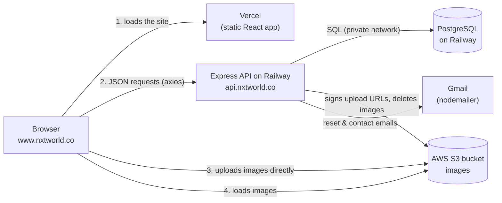

# Next World Collective Website

The website for **Next World Collective**. It has a public site (home, events, about us) and a private admin dashboard where the team manages articles, events and members.

- **Live site:** https://www.nxtworld.co (`nxtworld.co` redirects here)
- **API:** https://api.nxtworld.co

The repo has two apps that are deployed separately:

| Folder | What it is | Built with | Hosted on | Docs |
|---|---|---|---|---|
| [`frontend/`](frontend/) | The website people visit, plus the admin dashboard | React, Vite, Tailwind, TanStack Query | Vercel | [frontend/README.md](frontend/README.md) |
| [`backend/`](backend/) | A REST API that stores content and handles admin login | Node.js, Express, PostgreSQL | Railway | [backend/README.md](backend/README.md) |

## How the pieces fit together



1. **Loading the site.** Vercel serves the built React app, which is just static files. `frontend/vercel.json` sends every path to `index.html`, so React Router can handle routes like `/events` or `/admin/dashboard`.
2. **Getting and changing content.** The React app calls the API over HTTPS with JSON. The API's address comes from the frontend's `VITE_API_BASE_URL` variable. Reads like `GET /articles` are public. Anything that changes data needs a logged-in admin.
3. **Uploading images.** Images never go through the API. For an admin upload:
   - the frontend asks the API for a short-lived **presigned S3 URL** (`GET /uploads/presign`),
   - the browser `PUT`s the file straight to S3 with that URL,
   - the frontend saves the file's public URL (the presigned URL without its `?query`) in the item, such as an event's `flyerUrl`.
4. **Showing images.** Pages load images straight from the S3 bucket by URL.
5. **Sending email.** The API sends password-reset emails and forwards the public contact form to the team's inbox through Gmail.

### How admin login works

- `POST /auth/login` returns two tokens:
  - a short-lived **access token** (a JWT). The frontend keeps it only in memory and sends it as `Authorization: Bearer <token>`.
  - a long-lived **refresh token**, stored in an `httpOnly` cookie that JavaScript can't read.
- When the page loads, the frontend calls `POST /auth/refresh`. The browser sends the cookie automatically, and the API returns a new access token. That's how an admin stays logged in after a refresh.
- The site and API are on the same site (`www.nxtworld.co` and `api.nxtworld.co`), so the cookie, which is set with `sameSite: strict` in production, is sent correctly. **If either one moves to a different domain** (for example `*.vercel.app` or `*.up.railway.app`), browsers stop sending the cookie and admin login breaks.

### CORS

The API only accepts browser requests from the origins listed in its `ALLOWED_ORIGINS` variable (in production, `https://www.nxtworld.co,https://nxtworld.co`). If you add a new domain or preview URL, add it there too. Otherwise requests fail with a 500 "An unexpected error occured".

## Repo layout

```
.
├── backend/         Express API (see backend/README.md)
├── frontend/        React app (see frontend/README.md)
├── docs/
│   └── design-notes.md   original planning notes for the site's pages
├── start.sh         runs both apps and shares them publicly through ngrok
└── .github/workflows/deploy.yml   old EC2 deploy workflow (no longer used, see below)
```

## Quick start (local development)

You need Node.js 18 or later, and PostgreSQL running locally (for example with [Postgres.app](https://postgresapp.com)).

```bash
# 1. Backend
cd backend
cp .env.example .env        # fill in the DB, JWT, email and AWS values
npm install
# create the tables once (use Postgres.app's psql if psql isn't on your PATH):
psql -d nxtworldcollective -f database.sql
npm run create-admin -- you@example.com
npm run dev                 # http://localhost:3000

# 2. Frontend (in a second terminal)
cd frontend
cp .env.example .env        # VITE_API_BASE_URL=http://localhost:3000
npm install
npm run dev                 # http://localhost:5173
```

To share your local version with someone else (for example, to show a client), run `./start.sh` from the repo root. The [frontend README](frontend/README.md#sharing-a-preview-with-startsh) explains what it does.

## Deployment at a glance

| | Frontend | Backend |
|---|---|---|
| Host | Vercel | Railway (project `nextworld-website-backend`) |
| Deploys when | you push to `main` | you push to `main` (root directory `/backend`) |
| Domain | `www.nxtworld.co` | `api.nxtworld.co` (CNAME at Porkbun) |
| Config | `VITE_API_BASE_URL` in Vercel's project settings | Variables tab of the Railway service |
| Details | [frontend README](frontend/README.md#deployment-vercel) | [backend README](backend/README.md#deployment-railway) |

DNS for `nxtworld.co` is managed at **Porkbun**. Images live in the **`nxtworld`** S3 bucket (`us-east-1`) in the primary AWS account.

> **Note:** `.github/workflows/deploy.yml` is left over from when the backend ran on an AWS EC2 server. That server's account no longer exists, so the workflow fails on every push to `main`. Disable or delete it.
